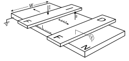
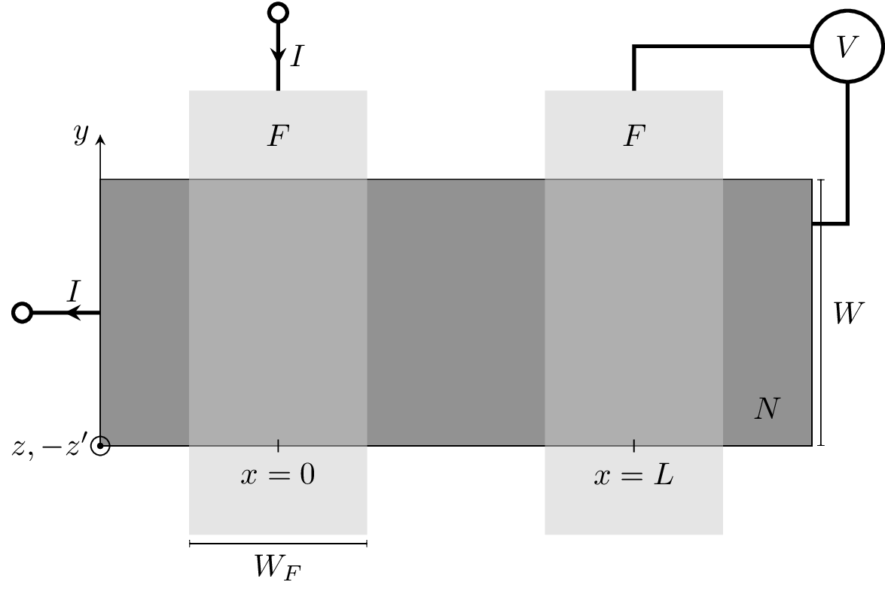

This page is a permanent portal to all work and software
related to my work on spin lifetime measurements through Hanle curve fitting.

## Generating Hanle fits

This is the recommended procedure for creating your own Hanle fits
using [evansosenko/spin-lifetime-analysis][spin-lifetime-analysis].

1. Obtain a copy of the code.
  - Fork or clone the [git repository][spin-lifetime-analysis] on GitHub.
  - Alternatively, if you are uncomfortable with version control,
    you can download a compressed archive of the code.
1. Add you own data under a subfolder in `data`.
   - Remove any existing data you will not be using,
     or do not have permission to use.
   - Modify `analysis/data.py`.
     This should contain classes that define how to import your data.
     See [scipy_data_fitting.Data][scipy-data_fitting:docs:data].
1. Define new models or modify existing models in `analysis/models.py`.
   - See [scipy_data_fitting.Model][scipy-data_fitting:docs:model].
1. Define new fits or modify existing fits in `analysis/fits.py`.
   - See [scipy_data_fitting.Fit][scipy-data_fitting:docs:fit].
1. Use `analysis/analysis.py` to control what fits to run and how to save the results.
1. Follow the instructions in the [README][spin-lifetime-analysis] on how to run and view the fits.

For details on how to use `scipy-data_fitting`, refer to the
[README][scipy-data_fitting] and [core documentation][scipy-data_fitting:docs].

## Effect of contacts on spin lifetime measurements in graphene

Paper published in Physical Review B on June 23, 2014 as
[Phys. Rev. B 89, 245436][physrevb.89.245436]
by Evan Sosenko, Huazhou Wei, and Vivek Aji;
[e-Print available on arXiv.org](https://arxiv.org/abs/1404.3211).
Some of the provided files or files generated by the provided code may be
Copyright © 2014 by the American Physical Society.
Read any provided license information before using.
Seek permission before using or modifying content
if unsure of the associated license.

### Curve fitting

- All curve fitting was done in Python using
  [scipy-data_fitting][scipy-data_fitting].

- The full source code used to generate the Hanle fits
  is hosted on the GitHub repository
  [evansosenko/spin-lifetime-analysis][spin-lifetime-analysis].

- A snapshot of the code used specifically for this paper can be found under
  [releases][spin-lifetime-analysis:releases].

- The fits presented in and related to this paper can be
  [viewed online][fitalyzer:spin-lifetime:1] (Firefox or Chrome recommended).

### Figure generation

- The full source code used to generate the figures containing the fits
  is hosted on the GitHub repository
  [evansosenko/aps-spin-lifetime-plots][aps-spin-lifetime-plots].

- A snapshot of the code used specifically for this paper can be found under
  [releases][spin-lifetime-analysis:releases].

### Nonlocal spin valve figure

Figure 1 is a Nonlocal Spin Valve written in TikZ.
It is available under the
Creative Commons Attribution 4.0 International License
on the GitHub repository
[evansosenko/tikz-nonlocal_spin_valve][tikz-nonlocal_spin_valve].

[][tikz-nonlocal_spin_valve]

### BibTeX

The `.bib` files used to generate the references are hosted on GitHub at
[evansosenko/references][references:aps].

### TeX source

The full TeX source is hosted on GitHub at [evansosenko/aps-spin-lifetime][aps-spin-lifetime].

## All related authored work

1. _Sosenko, E., & Aji, V. (2014, March). Effect of contacts on spin lifetime measurements in Graphene. Retrieved from https://evansosenko.com/deck-spin-lifetime/_
1. _Sosenko, E., Wei, H., & Aji, V. (2014). Effect of contacts on spin lifetime measurements in graphene. Retrieved from https://arxiv.org/abs/1404.3211v1_
1. _Sosenko, E., Wei, H., & Aji, V. (2014). Effect of contacts on spin lifetime measurements in graphene. Phys. Rev. B, 89(24), 245436. https://doi.org/10.1103/PhysRevB.89.245436_

[aps-spin-lifetime]: https://github.com/evansosenko/aps-spin-lifetime
[aps-spin-lifetime-plots]: https://github.com/evansosenko/aps-spin-lifetime-plots
[aps-spin-lifetime-plots:releases]: https://github.com/evansosenko/aps-spin-lifetime-plots/releases
[fitalyzer]: https://github.com/razor-x/
[fitalyzer:spin-lifetime:1]: https://io.evansosenko.com/fitalyzer/?firebase=spin-lifetime&set=-JKBzs0OL0DzzEimfcuq
[references:aps]: https://github.com/evansosenko/references
[scipy-data_fitting]: https://github.com/razor-x/scipy-data_fitting
[scipy-data_fitting:docs]: https://pythonhosted.org/scipy-data_fitting/
[scipy-data_fitting:docs:data]: https://pythonhosted.org/scipy-data_fitting/#scipy_data_fitting.Data
[scipy-data_fitting:docs:model]: https://pythonhosted.org/scipy-data_fitting/#scipy_data_fitting.Model
[scipy-data_fitting:docs:fit]: https://pythonhosted.org/scipy-data_fitting/#scipy_data_fitting.Fit
[spin-lifetime-analysis]: https://github.com/evansosenko/spin-lifetime-analysis
[spin-lifetime-analysis:releases]: https://github.com/evansosenko/spin-lifetime-analysis/releases
[tikz-nonlocal_spin_valve]: https://github.com/evansosenko/tikz-nonlocal_spin_valve
[physrevb.89.245436]: https://journals.aps.org/prb/abstract/10.1103/PhysRevB.89.245436
